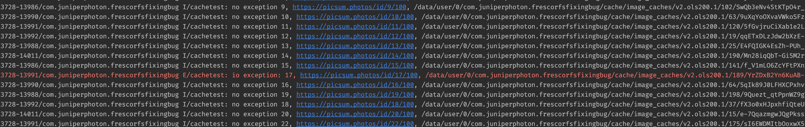

# FrescoFileNotFoundBug

This demo demonstrates an issue on this situation:

> Massively and concurrently fetching images from network and insert them into disk cache immediately, and then read the files on the same thread.

By saying `Massively and concurrently` I mean doing the work on every 50ms, please refer to [`MainActivity`](https://github.com/JuniperPhoton/FrescoFileNotFoundBug/blob/master/app/src/main/java/com/juniperphoton/frescobug/MainActivity.kt) for more details.

To know how to insert file into the existed disk cache, see [`FetchDataSubscriber`](https://github.com/JuniperPhoton/FrescoFileNotFoundBug/blob/master/app/src/main/java/com/juniperphoton/frescobug/FetchDataSubscriber.kt).

The issue is that **sometimes** it throws `java.io.FileNotFoundException` on reading saved files by opening a `FileInputStream`, even if the files do exist. The files can still be found using Android Studio's Device File Explorer can of course be opened. 

Furthermore, if you try to open the file exported by `content://` by other apps, or do a thread sleeping before accessing them, it will work.

## Producing the issue

To produce the same issue, please following the same steps:

1. Clone this project and make sure it can be run on your Android Phone;
2. Make sure your network connection to `https://picsum.photos` is fast (because we will request images **Massively and concurrently**. If not, replace the logic to get urls in `Urls.kt`.
3. Open `logcat` and filter with keyword `cachetest`.
4. Run the app, click the `GO` button and then observe.

If you run into my issue, your logcat should look like:

If there are any exceptions on opening `FileInputStream`, I will print a log with error level. In production environment, after getting the cached file, I try to decode to a Bitmap, which of course will also lead to failure.

## Temporary fixes

The classes under `com.juniperphoton.frescobug.storage` package are copied from `Fresco` and are the same, which are used to perform some temporary fixes.

I have found that there are some potential fixes:

1. `Thread.sleep(xxx)` before accessing saved files (of course, I can't accept this solution)
2. Change `SHARDING_BUCKET_COUNT` static field value from `100` to `10`, or modify the logic to **NOT** to save files to different buckets, e.g. from `/cache/image_caches/v2.ols200.1/63/9uXqYoOXvaVWkoSFzqrpdhua0bg.cnt` to `/cache/image_caches/v2.ols200.1/9uXqYoOXvaVWkoSFzqrpdhua0bg.cnt`
3. Shorten the name of `resourceId` (like `resourceId = resourceId.substring(0, 5)`), which will shorten the temp file and content file's name.
